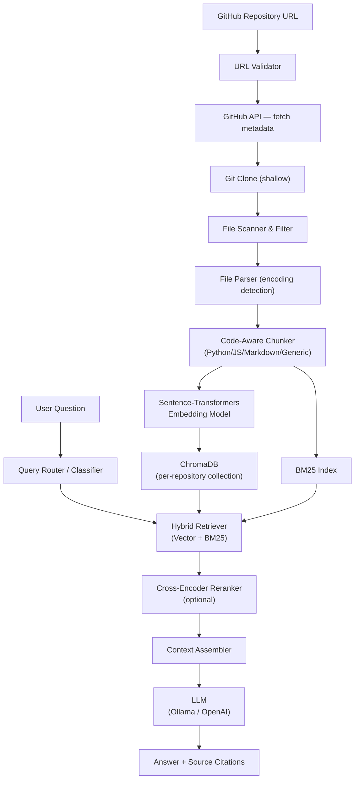

# 🔍 GitHub Repository RAG — AI Analyst

> **"ChatGPT for any GitHub repository."**
> Paste a GitHub URL → analyze → ask anything → get grounded answers with source citations.


---

## Architecture



---

## Features

- 🧠 **RAG-powered** — answers grounded in actual repository content
- 🔍 **Hybrid retrieval** — semantic vector search + BM25 keyword matching
- ✂️ **Code-aware chunking** — Python classes/functions, Markdown sections, JS/TS extraction
- 📎 **Source citations** — every answer links to exact file + line numbers
- 🗂️ **File explorer** — browse the repository file tree
- ⚡ **Real-time progress** — SSE streaming during ingestion
- 💬 **Conversation memory** — follow-up questions work naturally
- 🔒 **Prompt injection protection** — repository content treated as data, not instructions
- 🏪 **Caching** — same commit SHA → instant reuse
- 🔌 **Pluggable** — swap embedding model, LLM, vector DB without rewriting anything

---

## Quick Start

### Prerequisites

| Tool | Version |
|------|---------|
| Python | 3.10+ |
| Git | any |
| Ollama | latest |

### 1 — Install Ollama

**Windows/macOS:**
Download from [https://ollama.com/download](https://ollama.com/download)

**Linux:**
```bash
curl -fsSL https://ollama.com/install.sh | sh
```

### 2 — Pull a model

```bash
ollama pull qwen3:0.6b
```

> You can use any Ollama model. Larger models give better answers:
> - `qwen3:0.6b` — fast, ~400MB
> - `qwen3:1.7b` — better, ~1GB  
> - `llama3.2:3b` — great quality, ~2GB
> - `mistral:7b` — excellent, ~4GB

### 3 — Clone this repository

```bash
git clone https://github.com/your-username/github-rag
cd github-rag
```

### 4 — Set up the backend

```bash
cd backend

# Create a virtual environment
python -m venv venv

# Activate it
# Windows:
venv\Scripts\activate
# macOS/Linux:
source venv/bin/activate

# Install dependencies
pip install -r requirements.txt

# Copy environment config
cp .env.example .env
```

Edit `.env` if needed (defaults work out of the box for Ollama).

### 5 — Start the backend

```bash
# From backend/ directory (with venv activated)
python -m uvicorn app.main:app --reload --host 0.0.0.0 --port 8000
```

You should see:
```
INFO: Uvicorn running on http://0.0.0.0:8000
```

### 6 — Open the frontend

Simply open `frontend/index.html` in your browser, or serve it:

```bash
# Python simple server (from project root)
python -m http.server 3000 --directory frontend
```

Then visit: `http://localhost:3000`

---

## Environment Variables

| Variable | Default | Description |
|----------|---------|-------------|
| `GITHUB_TOKEN` | *(empty)* | GitHub PAT — optional, increases API rate limit |
| `LLM_PROVIDER` | `ollama` | `ollama` or `openai` |
| `LLM_MODEL` | `qwen3:0.6b` | Model name for Ollama or OpenAI |
| `OLLAMA_BASE_URL` | `http://localhost:11434` | Ollama server URL |
| `OPENAI_API_KEY` | *(empty)* | OpenAI key (if provider=openai) |
| `EMBEDDING_MODEL` | `all-MiniLM-L6-v2` | Sentence-transformers model |
| `EMBEDDING_DEVICE` | `cpu` | `cpu` or `cuda` |
| `CHROMA_PERSIST_DIR` | `./data/chroma` | ChromaDB storage directory |
| `RETRIEVAL_K` | `8` | Number of chunks returned per query |
| `RETRIEVAL_FETCH_K` | `20` | Fetch this many before reranking |
| `ENABLE_RERANKER` | `true` | Enable cross-encoder reranking |
| `RERANKER_MODEL` | `cross-encoder/ms-marco-MiniLM-L-6-v2` | Reranker model |
| `MAX_REPOSITORY_SIZE_MB` | `500` | Max clone size |
| `MAX_FILE_SIZE_MB` | `2` | Max individual file size |
| `MAX_FILES_PER_REPO` | `2000` | Max files to index |

---

## Example Questions

Once a repository is analyzed, you can ask:

```
What does this project do?
Explain the architecture end-to-end.
What technologies are used?
Explain the folder structure.
How do I run this project?
Where is authentication implemented?
Explain the UserService class.
What does main.py do?
How does the API communicate with the database?
What environment variables are required?
Are there any security concerns?
How can I contribute to this project?
Compare the auth service and the user service.
What are the main API endpoints?
```

---

## API Documentation

### Start ingestion
```http
POST /api/repositories/analyze
Content-Type: application/json

{ "url": "https://github.com/owner/repo", "force_reindex": false }
```

### Stream progress (SSE)
```http
GET /api/repositories/{repository_id}/status
```

### Get repository info
```http
GET /api/repositories/{repository_id}
```

### List all repositories
```http
GET /api/repositories
```

### Get file tree
```http
GET /api/repositories/{repository_id}/files
```

### Get file content
```http
GET /api/repositories/{repository_id}/files/{path}
```

### Ask a question
```http
POST /api/repositories/{repository_id}/chat
Content-Type: application/json

{
  "question": "Explain the authentication flow",
  "conversation_history": [],
  "conversation_id": null
}
```

### Generate project overview
```http
POST /api/repositories/{repository_id}/overview
```

### Delete repository index
```http
DELETE /api/repositories/{repository_id}
```

### Health check
```http
GET /api/health
GET /api/health/llm
```

---

## Running Tests

```bash
cd backend
pip install pytest pytest-asyncio httpx
pytest tests/ -v
```

---

## Switching LLM Providers

### Use OpenAI instead of Ollama

In `.env`:
```env
LLM_PROVIDER=openai
OPENAI_API_KEY=sk-...
OPENAI_MODEL=gpt-4o-mini
```

### Use a different Ollama model

```bash
ollama pull llama3.2:3b
```

In `.env`:
```env
LLM_MODEL=llama3.2:3b
```

---

## Using Docker Compose

```bash
# Start Ollama + backend
docker compose up -d

# Pull a model into the Ollama container
docker exec -it github-rag-ollama-1 ollama pull qwen3:0.6b
```

---

## Project Structure

```
github-rag/
├── backend/
│   ├── app/
│   │   ├── main.py               ← FastAPI entry point
│   │   ├── config.py             ← Settings (pydantic-settings)
│   │   ├── api/
│   │   │   ├── repositories.py   ← Repository CRUD + SSE progress
│   │   │   ├── chat.py           ← Chat + overview endpoints
│   │   │   └── files.py          ← File tree + file content
│   │   ├── ingestion/
│   │   │   ├── github_loader.py  ← URL validation + git clone
│   │   │   ├── file_filter.py    ← Ignore rules + size limits
│   │   │   ├── parser.py         ← File reading + encoding detection
│   │   │   └── chunker.py        ← Code-aware chunking
│   │   ├── rag/
│   │   │   ├── embeddings.py     ← Sentence-transformers wrapper
│   │   │   ├── vector_store.py   ← ChromaDB abstraction
│   │   │   ├── retriever.py      ← Hybrid BM25 + vector retrieval
│   │   │   ├── reranker.py       ← Cross-encoder reranker
│   │   │   ├── prompts.py        ← System prompt + context templates
│   │   │   ├── router.py         ← Query classifier
│   │   │   └── chain.py          ← RAG orchestration
│   │   ├── llm/
│   │   │   └── provider.py       ← LLM abstraction (Ollama/OpenAI)
│   │   ├── repository/
│   │   │   ├── analyzer.py       ← Technology detection
│   │   │   ├── metadata.py       ← Repository metadata + persistence
│   │   │   └── structure.py      ← File tree builder
│   │   ├── services/
│   │   │   ├── ingestion_service.py ← Full ingestion pipeline
│   │   │   └── chat_service.py      ← Chat delegation
│   │   └── utils/
│   │       ├── logger.py         ← Structured logging
│   │       └── cache.py          ← Commit SHA cache
│   └── tests/
├── frontend/
│   ├── index.html                ← Single-page app
│   ├── css/styles.css            ← Dark glassmorphism UI
│   └── js/
│       ├── api.js                ← API client
│       ├── app.js                ← Main controller
│       ├── chat.js               ← Chat UI
│       ├── explorer.js           ← File explorer
│       └── markdown.js           ← Markdown + syntax highlighting
├── data/
│   ├── chroma/                   ← Vector DB storage
│   └── repositories/             ← Temp clone directory
└── docker-compose.yml
```

---

## Troubleshooting

### "Cannot connect to Ollama"
Make sure Ollama is running:
```bash
ollama serve
```
Or check: `http://localhost:11434`

### "Model not found"
Pull the model first:
```bash
ollama pull qwen3:0.6b
```

### "GitHub API rate limit exceeded"
Add a `GITHUB_TOKEN` to `.env`. Create one at:
`https://github.com/settings/tokens` (no special scopes needed for public repos)

### "Repository too large"
Increase limits in `.env`:
```env
MAX_REPOSITORY_SIZE_MB=1000
MAX_FILES_PER_REPO=5000
```

### Embeddings are slow
Set `EMBEDDING_DEVICE=cuda` if you have a GPU, or use a smaller model:
```env
EMBEDDING_MODEL=paraphrase-MiniLM-L3-v2
```

### Frontend can't reach backend
Make sure the backend is on port 8000. The frontend `js/api.js` has `API_BASE = 'http://localhost:8000'` — update this if your server runs on a different port.

---

## Security Notes

- Repository files are treated as **data only** — never executed
- `.env` files are **never indexed**
- System prompt clearly separates instructions from repository context
- Path traversal is prevented in the files API
- Repository size and file count limits prevent resource exhaustion

---

## License

MIT License. See [LICENSE](LICENSE) for details.
